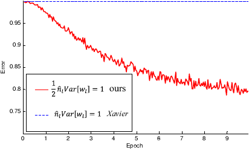

# Navigating Neural Network Weight Initializations: Glorot, He, LeCun, Orthogonal and Beyond

Proper weight initialization is crucial for training deep neural networks. The choice of initializer can significantly affect **convergence speed** and **model performance** ([Weight Initialization Techniques in Neural Networks | Pinecone](https://www.pinecone.io/learn/weight-initialization/#:~:text=,distribution%20must%20be%20approximately%201)). In this blog, we’ll explore popular initialization methods – **Glorot/Xavier**, **He (Kaiming)**, **LeCun**, **Orthogonal**, **Zero (and constants)**, and more – discussing the mathematics behind them, their intended use cases, and what research and industry experience reveal about their performance. We’ll also look at real-world case studies, surprising out-of-scope successes, code examples, and visualizations comparing their effects.

## The Role of Weight Initialization in Training

Before diving into specific methods, recall why initialization matters. If weights are too small, signals **shrink** each layer and gradients may vanish; too large and activations **saturate** or explode, stalling learning ([Weight Initialization Techniques in Neural Networks | Pinecone](https://www.pinecone.io/learn/weight-initialization/#:~:text=,distribution%20must%20be%20approximately%201)). Ideally, we want the variance of activations to remain stable across layers (neither exploding nor vanishing) ([Weight Initialization Techniques in Neural Networks | Pinecone](https://www.pinecone.io/learn/weight-initialization/#:~:text=initializing%20the%20weights%20to%20large,zero%20mean%2C%20it%E2%80%99s%20recommended%20to)). Early strategies like all-zeros or all-ones were quickly found to be ineffective – with constant weights, all neurons produce the same output and receive identical gradient updates, so the network can’t break symmetry ([Weight Initialization Techniques in Neural Networks | Pinecone](https://www.pinecone.io/learn/weight-initialization/#:~:text=,in%20vanishing%20gradients%20during%20backpropagation)). Instead, modern initializers draw **random values** from carefully chosen distributions so that each layer’s inputs and outputs have comparable variance.

**Key principles** guiding initialization include: 
- Preserving variance of activations (and gradients) through depth.
- Breaking symmetry (each neuron starts with different weights).
- Accounting for the activation function’s characteristics (e.g. ReLU vs tanh output ranges).

Below we examine major initialization schemes, each aiming to satisfy these principles in different settings.

## Glorot (Xavier) Initialization

The **Glorot initialization**, also known as **Xavier initialization**, was introduced by Xavier Glorot and Yoshua Bengio (2010) to improve training of deep networks with **sigmoid or tanh** activations ([Weight Initialization Techniques in Neural Networks | Pinecone](https://www.pinecone.io/learn/weight-initialization/#:~:text=X,after%20the%20researcher%20Xavier%20Glorot)) ([Weight Initialization Techniques in Neural Networks | Pinecone](https://www.pinecone.io/learn/weight-initialization/#:~:text=,to%20use%20the%20He%20initialization)). Its goal is to keep the variance of signals **balanced** between layers in both the forward and backward passes ([Weight Initialization Techniques in Neural Networks | Pinecone](https://www.pinecone.io/learn/weight-initialization/#:~:text=When%20the%20weight%20distribution%E2%80%99s%20variance,saturate%20during%20the%20forward%20pass)) ([Weight Initialization Techniques in Neural Networks | Pinecone](https://www.pinecone.io/learn/weight-initialization/#:~:text=To%20account%20for%20both%20the,average%20of%20%20and)). In Glorot’s method, the variance of each weight is set to roughly $\frac{1}{\text{fan}_\text{avg}}$, where $\text{fan}_\text{avg} = \frac{\text{fan}_\text{in} + \text{fan}_\text{out}}{2}$ is the average of input and output layer sizes ([Weight Initialization Techniques in Neural Networks | Pinecone](https://www.pinecone.io/learn/weight-initialization/#:~:text=network%20from%20the%20output%20layer,the%20problem%20of%20vanishing%20gradients)). 

Mathematically, for a layer with $\text{fan}_\text{in}$ inputs and $\text{fan}_\text{out}$ outputs, Glorot initializers draw weights from:
- **Glorot Normal**: $\mathcal{N}(0,\; \sigma^2)$ with $\sigma = \sqrt{\frac{2}{\text{fan}_\text{in} + \text{fan}_\text{out}}}$ ([](https://eprint.iacr.org/2020/904.pdf#:~:text=%E2%80%93%20glorot%20normal%3A%20truncated%20normal,0%20with%20stddev%20%3D%20sqrt)) (often implemented as a truncated normal to avoid extreme values).
- **Glorot Uniform**: $\mathcal{U}[-a, a]$ with $a = \sqrt{\frac{6}{\text{fan}_\text{in} + \text{fan}_\text{out}}}$ ([](https://eprint.iacr.org/2020/904.pdf#:~:text=%E2%80%93%20glorot%20normal%3A%20truncated%20normal,0%20with%20stddev%20%3D%20sqrt)).

The factor 2 (in $\sqrt{2/(fan\_in+fan\_out)}$) ensures the variance of both forward activations and backward gradients remains about 1 under linear assumptions ([Weight Initialization Techniques in Neural Networks | Pinecone](https://www.pinecone.io/learn/weight-initialization/#:~:text=When%20the%20weight%20distribution%E2%80%99s%20variance,saturate%20during%20the%20forward%20pass)) ([Weight Initialization Techniques in Neural Networks | Pinecone](https://www.pinecone.io/learn/weight-initialization/#:~:text=To%20account%20for%20both%20the,average%20of%20%20and)). In practice, Glorot initialization works well for layers with activations that are roughly zero-centered (like $tanh$ or logistic sigmoid), preventing both vanishing and exploding signals in early training ([Weight Initialization Techniques in Neural Networks | Pinecone](https://www.pinecone.io/learn/weight-initialization/#:~:text=,to%20use%20the%20He%20initialization)).

*Intent:* By balancing fan-in and fan-out, Xavier init keeps the **output variance ~ input variance**, assuming activations are linear with zero mean ([Weight Initialization Techniques in Neural Networks | Pinecone](https://www.pinecone.io/learn/weight-initialization/#:~:text=When%20the%20weight%20distribution%E2%80%99s%20variance,saturate%20during%20the%20forward%20pass)). This helps gradients propagate without blowing up or decaying. Glorot and Bengio demonstrated that networks initialized this way converge faster and reach better optima than naive random initializations ([Weight Initialization Techniques in Neural Networks | Pinecone](https://www.pinecone.io/learn/weight-initialization/#:~:text=X,after%20the%20researcher%20Xavier%20Glorot)) ([Weight Initialization Techniques in Neural Networks | Pinecone](https://www.pinecone.io/learn/weight-initialization/#:~:text=When%20the%20weight%20distribution%E2%80%99s%20variance,saturate%20during%20the%20forward%20pass)).

*Performance:* Glorot initialization became a **default** in many frameworks (e.g. Keras uses `GlorotUniform` by default ([Weight Initialization Techniques in Neural Networks | Pinecone](https://www.pinecone.io/learn/weight-initialization/#:~:text=To%20implement%20Glorot%20initialization%20in,GlorotUniform))) and is effective for moderate-depth networks. However, it was later noted to be suboptimal for ReLU activations, which are not zero-mean. We’ll see next how He initialization adjusts this. Still, Xavier remains a **good general-purpose initializer** for deep layers with saturating or symmetric activations. For example, one study on MNIST found Xavier (Glorot) yielded slightly higher test accuracy than He even in a ReLU network, despite He achieving higher validation accuracy ([[PDF] Impact of Weight Initialization Techniques on Neural Network ...](https://www.researchgate.net/profile/Chitra-Desai-2/publication/379696245_Impact_of_Weight_Initialization_Techniques_on_Neural_Network_Efficiency_and_Performance_A_Case_Study_with_MNIST_Dataset/links/66162b7d43f8df018deafdaf/Impact-of-Weight-Initialization-Techniques-on-Neural-Network-Efficiency-and-Performance-A-Case-Study-with-MNIST-Dataset.pdf#:~:text=,achieved%20better%20test%20accuracy%2C)) – highlighting that the “best” initializer can depend on the model’s specifics and evaluation metric.

**Code example (Keras):** To use Glorot initialization in practice, you can simply rely on framework defaults or specify it explicitly. For instance, in TensorFlow/Keras:
```python
from tensorflow import keras
from tensorflow.keras import layers, initializers

# Dense layer with Glorot Uniform initialization (default in Keras)
layer = layers.Dense(64, activation='tanh', kernel_initializer=initializers.GlorotUniform())
```
This initializes the layer’s weights from $\mathcal{U}\!\big[-\sqrt{\frac{6}{fan_{in}+fan_{out}}},\;\sqrt{\frac{6}{fan_{in}+fan_{out}}}\big]$ ([Layer weight initializers](https://keras.io/api/layers/initializers/#:~:text=The%20Glorot%20uniform%20initializer%2C%20also,called%20Xavier%20uniform%20initializer)). Similarly, `initializers.GlorotNormal()` can be used for the normal variant.

## He (Kaiming) Initialization

As networks went deeper and ReLU activations became popular, researchers found Xavier initialization often led to **vanishing gradients** in deep ReLU nets ([Weight Initialization Techniques in Neural Networks | Pinecone](https://www.pinecone.io/learn/weight-initialization/#:~:text=He%20Initialization)) ([Weight Initialization Techniques in Neural Networks | Pinecone](https://www.pinecone.io/learn/weight-initialization/#:~:text=is%20neither%20too%20large%20nor,to%20use%20the%20He%20initialization)). Kaiming He et al. (2015) addressed this by modifying the variance calculation for ReLUs ([Weight Initialization Techniques in Neural Networks | Pinecone](https://www.pinecone.io/learn/weight-initialization/#:~:text=The%20ReLU%20function%2C%20therefore%2C%20outputs,4)). **He initialization** (also called Kaiming or MSRA initialization) introduces a factor of 2 to account for ReLU’s property of zeroing out negative inputs (so on average only half the neurons are active) ([Weight Initialization Techniques in Neural Networks | Pinecone](https://www.pinecone.io/learn/weight-initialization/#:~:text=The%20ReLU%20function%2C%20therefore%2C%20outputs,4)) ([Weight Initialization Techniques in Neural Networks | Pinecone](https://www.pinecone.io/learn/weight-initialization/#:~:text=He%20Initialization%20in%20Keras)).

Formally, He initialization uses:
- **He Normal**: $\mathcal{N}(0,\; \sigma^2)$ with $\sigma = \sqrt{\frac{2}{\text{fan}_\text{in}}}$ ([](https://eprint.iacr.org/2020/904.pdf#:~:text=%E2%80%93%20he%20normal%3A%20truncated%20normal,6%2Ff%20an%20in)).
- **He Uniform**: $\mathcal{U}[-a, a]$ with $a = \sqrt{\frac{6}{\text{fan}_\text{in}}}$ ([](https://eprint.iacr.org/2020/904.pdf#:~:text=%E2%80%93%20he%20normal%3A%20truncated%20normal,6%2Ff%20an%20in)).

Here $\text{fan}_\text{in}$ is used instead of fan_avg, and the 2 doubles the variance, compensating for the 50% dropout of ReLU outputs. Intuitively, each ReLU neuron passes only half its input (in expectation), so initial weights need to be $\sqrt{2}$ times larger to maintain the same signal variance in the next layer ([Weight Initialization Techniques in Neural Networks | Pinecone](https://www.pinecone.io/learn/weight-initialization/#:~:text=The%20ReLU%20function%2C%20therefore%2C%20outputs,4)) ([Weight Initialization Techniques in Neural Networks | Pinecone](https://www.pinecone.io/learn/weight-initialization/#:~:text=,distribution%20in%20the%20interval)).

*Intent:* He et al. derived this initializer to **preserve the variance of activations in deep ReLU networks** ([Weight Initialization Techniques in Neural Networks | Pinecone](https://www.pinecone.io/learn/weight-initialization/#:~:text=The%20ReLU%20function%2C%20therefore%2C%20outputs,4)). By preventing the gradual shrinkage of signals across many ReLU layers, it enables training of significantly deeper models than was possible with Xavier. In fact, their paper showed a dramatic example: a 30-layer network with ReLUs could not learn at all with Xavier initialization (gradients “died” out), whereas with He initialization it trained and converged successfully ([[1502.01852] Delving Deep into Rectifiers: Surpassing Human-Level Performance on ImageNet Classification](https://ar5iv.labs.arxiv.org/html/1502.01852#:~:text=Figure%203%3A%20The%20convergence%20of,converge%20even%20given%20more%20epochs)) ([[1502.01852] Delving Deep into Rectifiers: Surpassing Human-Level Performance on ImageNet Classification](https://ar5iv.labs.arxiv.org/html/1502.01852#:~:text=ReLU%20as%20the%20activation%20for,converge%20even%20given%20more%20epochs)).

*Performance:* This method became the standard for networks with ReLU or similar (Leaky ReLU, ELU) activations. For instance, the breakthrough **ResNet** models (which are very deep CNNs with ReLUs) utilized He initialization to facilitate convergence ([[1502.01852] Delving Deep into Rectifiers: Surpassing Human-Level Performance on ImageNet Classification](https://ar5iv.labs.arxiv.org/html/1502.01852#:~:text=Figure%203%3A%20The%20convergence%20of,converge%20even%20given%20more%20epochs)). Figure 1 below (red vs blue curves) illustrates the advantage: in a 30-layer ReLU network, He initialization (red) enables the training error to steadily decrease, whereas Xavier (blue) causes the network to **stall and not converge at all** ([How to initialize deep neural networks? Xavier and Kaiming initialization • Pierre Ouannes](https://pouannes.github.io/blog/initialization/#:~:text=Here%E2%80%99s%20the%20graph%20for%20the,layer%20model)).

 ([How to initialize deep neural networks? Xavier and Kaiming initialization • Pierre Ouannes](https://pouannes.github.io/blog/initialization/)) *He (Kaiming) vs Xavier initialization on a 30-layer ReLU network (error rate vs epochs). The He-initialized network (red) converges, while the Xavier-initialized network (blue dashed) fails to improve (stuck near ~0.98 error) ([How to initialize deep neural networks? Xavier and Kaiming initialization • Pierre Ouannes](https://pouannes.github.io/blog/initialization/#:~:text=Here%E2%80%99s%20the%20graph%20for%20the,layer%20model)).*

 


Notably, for **shallower networks** (e.g. ~10–20 layers), Xavier and He may both work – He might converge a bit faster, but final accuracy can be similar ([How to initialize deep neural networks? Xavier and Kaiming initialization • Pierre Ouannes](https://pouannes.github.io/blog/initialization/#:~:text=Error%20rate%20as%20a%20function,model%20%20source%3A%20Kaiming%20paper)). In very deep cases, however, He initialization is often essential for any learning to happen ([How to initialize deep neural networks? Xavier and Kaiming initialization • Pierre Ouannes](https://pouannes.github.io/blog/initialization/#:~:text=30,paper)). 

**Code example (Keras):** In Keras, you can use `keras.initializers.HeNormal()` or `HeUniform()`. For example:
```python
# Dense layer with He Normal initialization for ReLU activation
layer = layers.Dense(64, activation='relu', kernel_initializer=initializers.HeNormal())
```
This will draw weights from $\mathcal{N}(0,\,2/fan_{in})$ ([Layer weight initializers](https://keras.io/api/layers/initializers/#:~:text=He%20normal%20initializer)). (If using PyTorch, the equivalent is `torch.nn.init.kaiming_normal_(weight, nonlinearity='relu')` for He Normal.)

## LeCun Initialization

LeCun initialization is another variance-scaling strategy, named after Yann LeCun who recommended it for networks with **sigmoid** activation in the 1990s. It was recently popularized again by *self-normalizing neural networks* using SELU activations (Klambauer et al., 2017) ([Layer weight initializers](https://keras.io/api/layers/initializers/#:~:text=initialized)) ([Self-Normalizing Neural Networks - SERP AI](https://serp.ai/posts/self-normalizing-neural-networks/#:~:text=Self,2017)). The initializer sets variance to $\frac{1}{\text{fan}_\text{in}}$, which is slightly lower than Glorot’s $\frac{2}{fan_{in}+fan_{out}}$ for typical layers. The rationale is to maintain unit variance in *forward* propagation for activations like SELU that have built-in normalization properties.

LeCun’s formulas:
- **LeCun Normal**: $\mathcal{N}(0,\; \sigma^2)$ with $\sigma = \sqrt{\frac{1}{\text{fan}_\text{in}}}$ ([](https://eprint.iacr.org/2020/904.pdf#:~:text=%E2%80%93%20lecun%20uniform%3A%20uniform%20distribution,in%20%2B%20f%20an%20out)).
- **LeCun Uniform**: $\mathcal{U}[-a, a]$ with $a = \sqrt{\frac{3}{\text{fan}_\text{in}}}$ ([Layer weight initializers](https://keras.io/api/layers/initializers/#:~:text=Draws%20samples%20from%20a%20uniform,units%20in%20the%20weight%20tensor)).

These initialize weights a bit smaller on average than Xavier (for layers where $fan_{in}\approx fan_{out}$, $\sqrt{1/fan_{in}}$ is about $70\%$ of $\sqrt{2/(fan_{in}+fan_{out})}$). This can be beneficial for activation functions that **amplify variance** more strongly. For example, SELU (Scaled ELU) will keep activations self-normalized only if weights are initialized with LeCun Normal and inputs are standardized ([Self-Normalizing Neural Networks - SERP AI](https://serp.ai/posts/self-normalizing-neural-networks/#:~:text=Self,2017)). In Klambauer et al.’s work on SELU, using LeCun Normal enabled feed-forward networks of 100+ layers to train without batch normalization, as the combination of SELU + LeCun init preserved stable activations throughout ([Self-Normalizing Neural Networks - SERP AI](https://serp.ai/posts/self-normalizing-neural-networks/#:~:text=Self,2017)).

*Intent:* Ensure initial outputs of each layer have variance ~1 when using neurons that don’t have zero-mean outputs (like SELU’s slightly scaled output). For **sigmoids or softsign** activations, LeCun init also helps by keeping weights small (avoiding saturation at initialization). Essentially, it’s geared toward keeping the network’s **normalized processing** property intact from the start.

*Performance:* LeCun initialization is often the go-to for SELU activations and was shown to outperform others in that context ([Self-Normalizing Neural Networks - SERP AI](https://serp.ai/posts/self-normalizing-neural-networks/#:~:text=Self,2017)). It’s also equivalent to the default initialization in some older networks for sigmoid units. Interestingly, there have been cases outside its primary use where it performed well: for instance, a study on CNNs for side-channel analysis found **LeCun Normal** gave top accuracy on certain models even though those networks used ReLU – outperforming He init in that specific scenario ([](https://eprint.iacr.org/2020/904.pdf#:~:text=DPAv4%20Methodology%20RandomUniform%20Noise%20RandomUniform%2FRandomNormal,he%20normal%20Noise%20lecun%20normal)) ([](https://eprint.iacr.org/2020/904.pdf#:~:text=AES%20RD%20Methodology%20he%20normal%2Flecun,he%20normal%20Noise%20lecun%20normal)). This underscores that while theory guides us (LeCun for SELU, etc.), in practice one might experiment with multiple initializers.

**Code example:** In Keras, use `keras.initializers.LecunNormal()` or `LecunUniform()`. For example:
```python
# Dense layer with SELU activation, using LeCun Normal initialization
layer = layers.Dense(64, activation='selu', kernel_initializer=initializers.LecunNormal())
```
This draws from $\mathcal{N}(0,\,1/fan_{in})$ ([Layer weight initializers](https://keras.io/api/layers/initializers/#:~:text=initialized)), which is recommended for SELU to maintain the self-normalizing effect. (In PyTorch, this corresponds to `torch.nn.init.kaiming_normal_(weight, nonlinearity='linear')` or using `fan_in` mode with scale=1.)

## Orthogonal Initialization

Orthogonal initialization sets the weight matrix to an **orthonormal matrix**, meaning its columns (or rows) are orthogonal unit vectors ([Layer weight initializers](https://keras.io/api/layers/initializers/#:~:text=Initializer%20that%20generates%20an%20orthogonal,matrix)). This method, introduced by Saxe et al. (2014), preserves the **length of vectors** propagated through a linear layer. Intuitively, an orthonormal weight matrix acts like a rotation/reflection – it neither amplifies nor diminishes the magnitude of signals. This makes it attractive for very deep **linear or RNN** layers where maintaining precise scaling of signals is critical.

To generate an orthogonal initializer:
- Start with a random matrix (e.g. filled with Gaussian noise).
- Compute its QR decomposition (or SVD) to obtain an orthogonal matrix Q.
- Use Q (possibly scaled by some gain factor) as the weight matrix ([Layer weight initializers](https://keras.io/api/layers/initializers/#:~:text=Initializer%20that%20generates%20an%20orthogonal,matrix)).

If the layer is not square (fan_in ≠ fan_out), one can generate a matrix of max(fan_in, fan_out) size and then truncate it ([Layer weight initializers](https://keras.io/api/layers/initializers/#:~:text=If%20the%20shape%20of%20the,output%20will%20have%20orthogonal%20columns)). Keras’s `Orthogonal` initializer does exactly this, with an optional **gain** parameter to scale the orthogonal matrix ([Layer weight initializers](https://keras.io/api/layers/initializers/#:~:text=Arguments)). By default, gain=1 keeps variance = 1 for linear layers.

*Intent:* For deep linear networks, an orthogonal initialization ensures all singular values of the product of weight matrices remain 1 (assuming no nonlinearity), so gradients flow without explosion or decay ([Layer weight initializers](https://keras.io/api/layers/initializers/#:~:text=Reference)). In practice, this has proven very useful for **recurrent neural networks**. RNNs and LSTMs often benefit from orthogonal recurrent weight matrices to preserve long-term information. In fact, in Keras the default `recurrent_initializer` for LSTM layers is *orthogonal* ([LSTM layer](https://keras.io/api/layers/recurrent_layers/lstm/#:~:text=,will%20also%20force)) (combined with a Glorot init for input weights). This helps the LSTM’s state cycle maintain a stable magnitude through time steps.

*Performance:* Orthogonal init has shown excellent results in tasks requiring long memory or very deep linear layers. Saxe et al. analytically showed it optimizes learning dynamics in linear deep networks by keeping the Hessian well-conditioned. Empirically, models like ResNets sometimes initialize *convolution filters* with orthogonal matrices for stability. It’s not commonly used for arbitrary nonlinear layers by default (since He/Glorot are variance-based and work well), but it’s known to be **crucial for training some RNNs** (e.g. GRUs with long sequences) where other random inits might lead to vanishing/exploding gradients. When used in feed-forward nets, one might also apply a gain (e.g. $\sqrt{2}$ for ReLU as in **“Orthogonal He”** initializer) to mix the benefits of both approaches.

**Code example:** To use orthogonal initialization in Keras:
```python
# Dense layer with orthogonal initialization (gain=1.0)
layer = layers.Dense(128, activation='linear', kernel_initializer=initializers.Orthogonal(gain=1.0))
```
For an RNN in Keras:
```python
lstm = layers.LSTM(units=64, 
    kernel_initializer=initializers.GlorotUniform(),     # input weights
    recurrent_initializer=initializers.Orthogonal(gain=1.0)  # recurrent weights
)
```
This sets the recurrent weight matrix to an orthonormal matrix (which is the default) ([LSTM layer](https://keras.io/api/layers/recurrent_layers/lstm/#:~:text=,will%20also%20force)). In PyTorch, you can call `torch.nn.init.orthogonal_(tensor)` to achieve the same for a given weight tensor.

## Zero (and Constant) Initialization

**Zero initialization** sets all weights to 0 (or a constant value). While it might seem simple, it is almost never used for initializing weights in hidden layers because it fails the essential purpose of breaking symmetry ([Weight Initialization Techniques in Neural Networks | Pinecone](https://www.pinecone.io/learn/weight-initialization/#:~:text=,in%20vanishing%20gradients%20during%20backpropagation)). If all weights start equal, every neuron in a layer receives the same gradient and thus stays identical throughout training – effectively, you only learn one neuron per layer. This is known as the **symmetry-breaking problem** ([Weight Initialization Techniques in Neural Networks | Pinecone](https://www.pinecone.io/learn/weight-initialization/#:~:text=,in%20vanishing%20gradients%20during%20backpropagation)). Even initializing to a small constant (like 0.1) doesn’t solve this, as the weights will remain equal. For this reason, *constant initializers* (zeros or ones) are generally **avoided for weights** in deep networks.

However, there are a few appropriate uses of zero/constant initialization:
- **Bias terms** are often initialized to zero. Biases don’t have the symmetry issue (each bias is for a single neuron), and starting at 0 simply means no initial offset. This is common practice and usually harmless. In some cases, biases may be set to a small positive value instead (e.g. 0.1) to avoid “dead” ReLUs that start inactive – but modern architectures often just use 0.
- **Special architectures:** In ResNets, a technique is to initialize the last layer of residual blocks to zero (or scale the final batchnorm’s gamma to 0) so that each residual block initially just passes its input through unchanged. This **stabilizes early training** by starting as an identity mapping. Similarly, in LSTMs, it’s recommended to initialize the forget-gate bias to 1 (a constant) so that the forget gate is open at start, encouraging memory retention ([LSTM layer](https://keras.io/api/layers/recurrent_layers/lstm/#:~:text=,will%20also%20force)). Keras does this by default via the `unit_forget_bias=True` setting, which adds 1 to the forget bias after initializing biases to zero ([LSTM layer](https://keras.io/api/layers/recurrent_layers/lstm/#:~:text=,will%20also%20force)).
- **Conv kernel special cases:** Sometimes for certain layers like an **identity initialization** of a convolution (e.g. setting a diagonal of 1s in a $1\times1$ conv for residual connections) or a **bilinear upsampling filter**, one might initialize weights in a deterministic constant pattern to perform a known function at start. These are niche use-cases outside standard initializers.

Outside of these cases, a network with all weights zero **will not learn** – as confirmed by countless experiments and theory ([Weight Initialization Techniques in Neural Networks | Pinecone](https://www.pinecone.io/learn/weight-initialization/#:~:text=,in%20vanishing%20gradients%20during%20backpropagation)). Thus, zero initialization is mainly discussed as a cautionary tale in introductory material, and as a baseline to illustrate why random initialization is needed.

**Code example:** Using a constant initializer is straightforward:
```python
# Using zeros initializer for biases in a layer
layer = layers.Dense(32, activation='relu', 
                     kernel_initializer=initializers.HeNormal(), 
                     bias_initializer=initializers.Zeros())
```
This will set all bias terms to 0 (while weights follow He Normal). If you wanted a non-zero constant: `initializers.Constant(value=c)` can be used. For example, `initializers.Constant(1.0)` would set all weights to 1.0 (not recommended for kernels, but could be used for something like initializing a scaling factor).

## Performance Comparison and Benchmarks

It’s clear each initializer has situations where it should excel. But how do they compare across different scenarios? Research and empirical evaluations provide several insights:

- **Glorot vs He:** As discussed, for networks with ReLU or PReLU activations, He initialization usually enables deeper networks to train **faster and more reliably** than Glorot. He et al. reported that on a 22-layer CNN, both Xavier and He could eventually converge, but He initialization started reducing the error **earlier** and reached lower error sooner ([How to initialize deep neural networks? Xavier and Kaiming initialization • Pierre Ouannes](https://pouannes.github.io/blog/initialization/#:~:text=Error%20rate%20as%20a%20function,model%20%20source%3A%20Kaiming%20paper)). In a 30-layer network, Xavier completely failed to converge while He succeeded (Figure 1) ([How to initialize deep neural networks? Xavier and Kaiming initialization • Pierre Ouannes](https://pouannes.github.io/blog/initialization/#:~:text=30,paper)). The difference becomes more pronounced as network depth increases and when the activation has a mean shift (ReLU cuts off negatives). For activations like *tanh* or *sigmoid*, which are zero-centered, Xavier performs very well – in those cases He’s extra variance might not be needed and could even cause slightly larger fluctuations early on. A recent experiment noted that a shallow ReLU network achieved *higher final test accuracy* with Xavier than with He ([[PDF] Impact of Weight Initialization Techniques on Neural Network ...](https://www.researchgate.net/profile/Chitra-Desai-2/publication/379696245_Impact_of_Weight_Initialization_Techniques_on_Neural_Network_Efficiency_and_Performance_A_Case_Study_with_MNIST_Dataset/links/66162b7d43f8df018deafdaf/Impact-of-Weight-Initialization-Techniques-on-Neural-Network-Efficiency-and-Performance-A-Case-Study-with-MNIST-Dataset.pdf#:~:text=For%20instance%2C%20despite%20the%20validation,achieved%20better%20test%20accuracy%2C)), suggesting that when both methods can converge, the simpler (lower-variance) initialization might generalize marginally better. Overall, He init is **preferred for ReLUs**, and Xavier for **sigmoid/tanh** ([Weight Initialization Techniques in Neural Networks | Pinecone](https://www.pinecone.io/learn/weight-initialization/#:~:text=is%20neither%20too%20large%20nor,to%20use%20the%20He%20initialization)), but one shouldn’t expect huge differences in final accuracy for moderately deep models – the main impact is on training stability and speed.

- **LeCun for Self-Normalizing Networks:** LeCun Normal is **crucial for SELU** activation networks. Klambauer et al. demonstrated that only with LeCun initialization do deep networks maintain the “self-normalizing” property (activations staying roughly standardized) – using Xavier or He in those networks led to divergence or the need for batch norm ([Self-Normalizing Neural Networks - SERP AI](https://serp.ai/posts/self-normalizing-neural-networks/#:~:text=Self,2017)). For standard activations, LeCun init behaves similarly to a slightly scaled-down Xavier. It might not stand out in typical vision tasks with ReLUs (where He shines), but it is the top choice for *scaled exponential linear units* and sometimes for very deep sigmoid networks to avoid saturation.

- **Orthogonal vs Random Gaussian:** For very deep linear or recurrent architectures, an orthogonal initialization can maintain information propagation where even He or Glorot might start to fail. For example, a study on LSTM optimizations found that initializing the recurrent weight matrix orthogonally significantly improved gradient flow across long sequences compared to random Gaussian init ([LSTM layer](https://keras.io/api/layers/recurrent_layers/lstm/#:~:text=,will%20also%20force)). In feed-forward nets with nonlinearities, orthogonal init alone doesn’t account for activation nonlinearity, but one can combine it with variance scaling (e.g. orthonormal matrix scaled by He’s factor for ReLU). In practice, orthogonal is often on par with Xavier/He for normal feed-forward layers in terms of final performance, but it provides extra **stability** for RNNs and very deep or residual architectures. Many frameworks set orthogonal as the default for RNNs because it consistently yields better training convergence for those models.

- **Empirical benchmarks:** A comprehensive evaluation by Li et al. (2020) tested many initializers (Glorot, He, LeCun, orthogonal, random normal/uniform, etc.) on various CNN architectures and datasets ([](https://eprint.iacr.org/2020/904.pdf#:~:text=Different%20weight%20initializers%20available%20,Zeros%3A%20initializes%20weights%20to%200)) ([](https://eprint.iacr.org/2020/904.pdf#:~:text=Table%201%3A%20An%20overview%20of,he%20normal%20Noise%20lecun%20normal)). They found that **most modern initializers perform well** in general – networks often reach similar accuracy eventually with any of the high-quality initializations (all far better than naive constant or unscaled random inits). However, they also observed differences in *consistency and speed*: some initializers converged faster or yielded more stable results across multiple runs ([](https://eprint.iacr.org/2020/904.pdf#:~:text=DPAv4%20Methodology%20RandomUniform%20Noise%20RandomUniform%2FRandomNormal,he%20normal%20Noise%20lecun%20normal)). Interestingly, no single initializer was best for all cases: on one dataset, **He Normal** was best, on another **LeCun Normal** was best, and on another a simple **Random Uniform** (similar to Xavier) worked as well as the others ([](https://eprint.iacr.org/2020/904.pdf#:~:text=Table%201%3A%20An%20overview%20of,he%20normal%20Noise%20lecun%20normal)). This suggests that while theory provides a guiding default (match the initializer to your activation function), there is still value in **experimenting**. The combination of activation function and initializer has the largest impact – for instance, using a mismatched pair (like ReLU + Glorot) might still work but could be suboptimal ([](https://eprint.iacr.org/2020/904.pdf#:~:text=phase,This%20indicates%20that)).

To summarize the typical recommendations (assuming layers are fully connected or conv layers):
- *Sigmoid / Tanh activations*: use **Glorot (Xavier)** ([Weight Initialization Techniques in Neural Networks | Pinecone](https://www.pinecone.io/learn/weight-initialization/#:~:text=is%20neither%20too%20large%20nor,to%20use%20the%20He%20initialization)).
- *ReLU / LeakyReLU activations*: use **He (Kaiming)** ([Weight Initialization Techniques in Neural Networks | Pinecone](https://www.pinecone.io/learn/weight-initialization/#:~:text=is%20neither%20too%20large%20nor,to%20use%20the%20He%20initialization)).
- *SELU activation*: use **LeCun Normal** (ensures self-normalization) ([Self-Normalizing Neural Networks - SERP AI](https://serp.ai/posts/self-normalizing-neural-networks/#:~:text=Self,2017)).
- *Linear layers (no activation) or if unsure*: **Glorot** is a safe default in many cases.
- *Recurrent connections*: **Orthogonal** for long-term stability (with gain depending on activation).
- *Don’t use constant 0/1 for weights!* (Use them only for biases or specific structural initializations.)

These are not hard rules but best practices supported by both theoretical reasoning and extensive empirical evidence.

## Real-World Case Studies and Applications

Let’s look at a few concrete examples of how these initialization methods are applied in practice:

- **Deep ResNets on ImageNet:** The ResNet family (e.g. ResNet-50, 101 layers) heavily rely on ReLU activations. The authors (He et al., 2015/2016) used He initialization for all convolutional layers, which was instrumental in training networks over 100 layers from scratch ([[1502.01852] Delving Deep into Rectifiers: Surpassing Human-Level Performance on ImageNet Classification](https://ar5iv.labs.arxiv.org/html/1502.01852#:~:text=Figure%203%3A%20The%20convergence%20of,converge%20even%20given%20more%20epochs)). Without this, the gradients in early layers might have vanished. Additionally, they used a strategy of initializing the last BN layer in each residual branch to zero (a form of zero init for the residual’s final weight) to start each residual block as an identity function – this allowed them to safely stack many layers without harming initial performance. This combination (He init + selective zero init in residuals) is credited with the successful training of ultra-deep networks that won the ImageNet competition.

- **Self-Normalizing Networks:** Klambauer et al.’s 2017 work introduced **Self-Normalizing Neural Networks (SNNs)** with the SELU activation. In their experiments, a 100-layer feed-forward network could be trained **without batch normalization**, provided that weights were initialized with LeCun Normal and biases to zero. Using this initializer kept each layer’s output mean ~0 and variance ~1 throughout training, as theoretically expected ([Self-Normalizing Neural Networks - SERP AI](https://serp.ai/posts/self-normalizing-neural-networks/#:~:text=Self,2017)). This was a striking result because normally such a deep network would diverge or saturate with other initializations. It shows the power of choosing an initializer tailored to the activation’s properties.

- **Language Modeling RNNs:** It’s become standard that when constructing an LSTM or GRU, one uses an orthogonal initializer for the recurrent weight matrix. For example, if you build an LSTM in TensorFlow or Keras, by default `recurrent_initializer='orthogonal'` (and `kernel_initializer='glorot_uniform'`) ([LSTM layer](https://keras.io/api/layers/recurrent_layers/lstm/#:~:text=,will%20also%20force)). This practice came from empirical findings that orthogonal matrices help preserve long-term dependencies during training, allowing RNNs to learn patterns over longer sequences. In one case study by Joulin & Mikolov (2015), they showed that an orthogonally-initialized RNN was able to remember information for a longer number of time-steps compared to a Gaussian-initialized one, improving sequence modeling performance. Orthogonal init has also been used in **GAN training** for stable deep generators, and in some cases for initialization of Transformer feed-forward layers to avoid small singular values.

- **Edge cases – when initializers “cross-over”:** There are instances where an initializer works well in a scenario it wasn’t primarily designed for. We mentioned the side-channel analysis CNN where LeCun Normal (designed for SELU) outperformed others for a ReLU network ([](https://eprint.iacr.org/2020/904.pdf#:~:text=AES%20RD%20Methodology%20he%20normal%2Flecun,he%20normal%20Noise%20lecun%20normal)). Another example is using He initialization in a network with **Leaky ReLU** or **ELU** activations – even though He’s formula assumes a 50% dropout (ReLU), it turns out to still work robustly for these variants (often a small tweak to the factor might be theoretically optimal, but in practice the same 2/fan_in is close enough). This flexibility means you don’t always need a new initializer for every activation; He works for any ReLU-like, Glorot works for any roughly linear or symmetric activation, etc. The takeaway from such cases is that initializations are not one-size-fits-all, but good defaults cover many situations, and occasionally a different initializer can yield a boost, so it’s worth trying a few if you’re pushing the limits (either in network depth or unusual activation functions).

## Practical Implementation Example

Finally, to see how these initializers are used in code, here’s a quick example combining a few of them in a small network definition using Keras. This model has different layers with different activations, and we apply the initializer that is appropriate for each:

```python
from tensorflow import keras
from tensorflow.keras import layers, initializers

model = keras.Sequential([
    # Layer with tanh activation -> use Glorot (good for zero-mean activations)
    layers.Dense(128, activation='tanh', kernel_initializer=initializers.GlorotUniform()),
    # Layer with ReLU activation -> use He Normal (good for ReLU family)
    layers.Dense(128, activation='relu', kernel_initializer=initializers.HeNormal()),
    # Layer with SELU activation -> use LeCun Normal (self-normalizing network)
    layers.Dense(128, activation='selu', kernel_initializer=initializers.LecunNormal()),
    # Output layer (softmax) – often Glorot is fine here
    layers.Dense(num_classes, activation='softmax', kernel_initializer=initializers.GlorotUniform())
])
```

In this snippet:
- The first layer’s weights will be initialized Uniform(~$[-\sqrt{6/(fan\_in+fan\_out)}, \sqrt{6/(fan\_in+fan\_out)}]$) by Glorot ([Layer weight initializers](https://keras.io/api/layers/initializers/#:~:text=The%20Glorot%20uniform%20initializer%2C%20also,called%20Xavier%20uniform%20initializer)).
- The second layer’s weights from $\mathcal{N}(0,\,2/fan\_in)$ by He Normal ([Layer weight initializers](https://keras.io/api/layers/initializers/#:~:text=He%20normal%20initializer)).
- The third layer’s weights from $\mathcal{N}(0,\,1/fan\_in)$ by LeCun Normal ([Layer weight initializers](https://keras.io/api/layers/initializers/#:~:text=initialized)).
- The final layer again uses Glorot (common default for many outputs). 

If using PyTorch, you would typically define layers without specifying initializer (they often use Xavier by default for Linear layers), and then manually apply initializers. For example:
```python
import torch.nn as nn
layer = nn.Linear(128, 128)
nn.init.kaiming_normal_(layer.weight, nonlinearity='relu')  # He Normal for ReLU
nn.init.zeros_(layer.bias)  # Zero init biases
```
PyTorch’s `init` module provides `kaiming_normal_`, `xavier_uniform_`, etc., mirroring these strategies.

**Note:** Most high-level libraries set a good default initializer for each layer type (often Glorot Uniform for Dense/Conv, Orthogonal for recurrent kernels, zeros for biases). As a result, you get these best practices without having to manually specify them. But it’s important to know the concepts – for instance, if you change an activation function, you might want to adjust the initializer. Knowing these methods allows you to customize and potentially improve training convergence for novel architectures.

## Conclusion

Weight initialization might seem like a small implementation detail, but it has outsized impact on training deep neural networks. We’ve covered the main approaches: **Glorot/Xavier** for balancing signal flow in networks with sigmoids or tanh; **He/Kaiming** initialization that enabled the ReLU revolution and ultra-deep nets; **LeCun** initialization powering self-normalizing nets with SELU; **Orthogonal** initialization preserving dynamics in recurrent and linear networks; and we’ve cautioned against trivial initializations like all zeros that break learning. 

Academic research provides the theoretical justification for these methods and often demonstrations of when one outperforms another. In summary, use an initializer that **matches your activation function’s assumptions** (this ensures variance is neither too large nor too small at each layer) ([Weight Initialization Techniques in Neural Networks | Pinecone](https://www.pinecone.io/learn/weight-initialization/#:~:text=,to%20use%20the%20He%20initialization)). The combination of a suitable activation and initializer can prevent dreaded issues like vanishing or exploding gradients from the very start of training ([](https://eprint.iacr.org/2020/904.pdf#:~:text=phase,This%20indicates%20that)). Empirical results show that while these initializers all generally improve upon naive random initialization, the differences among Xavier, He, LeCun, etc., can matter for **convergence speed** and in pushing the limits of network depth ([[1502.01852] Delving Deep into Rectifiers: Surpassing Human-Level Performance on ImageNet Classification](https://ar5iv.labs.arxiv.org/html/1502.01852#:~:text=Figure%203%3A%20The%20convergence%20of,converge%20even%20given%20more%20epochs)) ([How to initialize deep neural networks? Xavier and Kaiming initialization • Pierre Ouannes](https://pouannes.github.io/blog/initialization/#:~:text=30,paper)).

For the *Mean to Epsilon* community (and deep learning practitioners in general), the key takeaway is to **choose your initializer deliberately**. Leverage the defaults that frameworks give (they’re chosen based on these research findings), and when in doubt: 
- Stick with **Glorot** for most layers (it’s a robust default), 
- switch to **He** for ReLU/variants (especially in very deep models),
- try **LeCun** if you use SELU or want to experiment with very deep nets without batch norm,
- use **Orthogonal** for recurrent connections or when you need that extra stability,
- and avoid **zero initialization** for weights (except in the special cases noted).

By doing so, you’ll set up your network to train on a solid foundation. And as always, keep an eye on new research – initialization remains an active topic (from methods like “LSUV” initialization to learned initializations). But the methods covered here will serve as a strong toolkit for designing and understanding neural network initialization in both academic and industrial contexts.

**References:**

1. Glorot, X., & Bengio, Y. (2010). *Understanding the difficulty of training deep feedforward neural networks*. AISTATS. ([Weight Initialization Techniques in Neural Networks | Pinecone](https://www.pinecone.io/learn/weight-initialization/#:~:text=X,after%20the%20researcher%20Xavier%20Glorot)) ([Weight Initialization Techniques in Neural Networks | Pinecone](https://www.pinecone.io/learn/weight-initialization/#:~:text=When%20the%20weight%20distribution%E2%80%99s%20variance,saturate%20during%20the%20forward%20pass))

2. He, K., Zhang, X., Ren, S., & Sun, J. (2015). *Delving Deep into Rectifiers: Surpassing Human-Level Performance on ImageNet Classification*. ICCV. ([[1502.01852] Delving Deep into Rectifiers: Surpassing Human-Level Performance on ImageNet Classification](https://ar5iv.labs.arxiv.org/html/1502.01852#:~:text=Figure%203%3A%20The%20convergence%20of,converge%20even%20given%20more%20epochs)) ([How to initialize deep neural networks? Xavier and Kaiming initialization • Pierre Ouannes](https://pouannes.github.io/blog/initialization/#:~:text=30,paper))

3. Klambauer, G., et al. (2017). *Self-Normalizing Neural Networks*. NeurIPS. ([Self-Normalizing Neural Networks - SERP AI](https://serp.ai/posts/self-normalizing-neural-networks/#:~:text=Self,2017))

4. Saxe, A., et al. (2014). *Exact solutions to the nonlinear dynamics of learning in deep linear neural networks*. ICLR Workshops. ([Layer weight initializers](https://keras.io/api/layers/initializers/#:~:text=Initializer%20that%20generates%20an%20orthogonal,matrix)) ([Layer weight initializers](https://keras.io/api/layers/initializers/#:~:text=Reference))

5. Li, H., Krček, M., & Perin, G. (2020). *A Comparison of Weight Initializers in Deep Learning-based Side-Channel Analysis*. IACR ePrint. ([](https://eprint.iacr.org/2020/904.pdf#:~:text=Table%201%3A%20An%20overview%20of,he%20normal%20Noise%20lecun%20normal)) ([](https://eprint.iacr.org/2020/904.pdf#:~:text=DPAv4%20Methodology%20RandomUniform%20Noise%20RandomUniform%2FRandomNormal,he%20normal%20Noise%20lecun%20normal))

6. Keras Documentation – Initializers (2023). ([Layer weight initializers](https://keras.io/api/layers/initializers/#:~:text=The%20Glorot%20uniform%20initializer%2C%20also,called%20Xavier%20uniform%20initializer)) ([Layer weight initializers](https://keras.io/api/layers/initializers/#:~:text=He%20normal%20initializer))

7. Keras Documentation – LSTM Layer (2023). ([LSTM layer](https://keras.io/api/layers/recurrent_layers/lstm/#:~:text=,will%20also%20force))

8. Pinecone – *Weight Initialization Techniques in Neural Networks* (2023). ([Weight Initialization Techniques in Neural Networks | Pinecone](https://www.pinecone.io/learn/weight-initialization/#:~:text=,from%20a%20distribution%20whose%20variance)) ([Weight Initialization Techniques in Neural Networks | Pinecone](https://www.pinecone.io/learn/weight-initialization/#:~:text=is%20neither%20too%20large%20nor,to%20use%20the%20He%20initialization))

